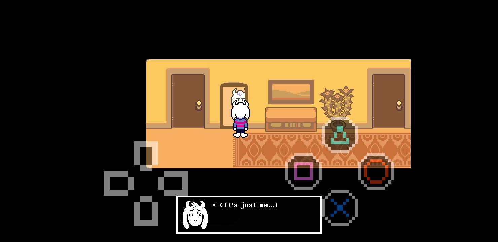
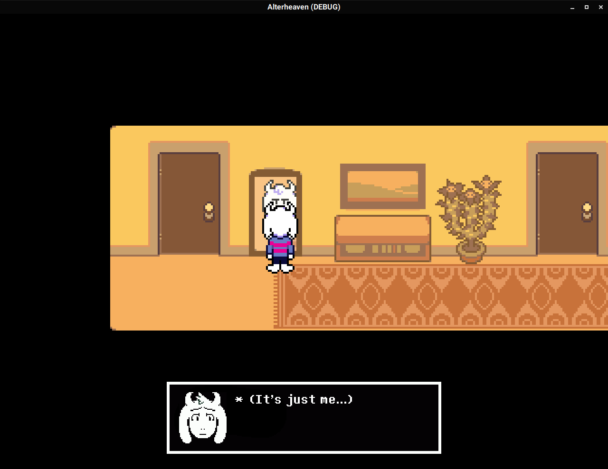

# Landfill of Broken Code and Stolen Assets(TM)
Not finished (duh!)

## Stuff which is finished, in development or broken
If something is not on this list, that means its either extremely broken or not being developed yet

| Status | Feature | Notes |
| ------ | ------- | ----- |
| ✅ | Player movement        | Should work and feel (mostly) like in Deltarune |
| ⚠️ | Touch support          | Very basic, needs more refining(like, come on, i can do better than these pesky PS4 buttons and a D-Pad!) |
| ⚠️ | Dialog system          | Mostly done, but currently its a bit broken(skip doesnt work for example) |
| ⚠️ | Level change (markers) | ~Only works when used linearly, if a level has several level changes(`ch1/level/living_room.tscn`), the player will spawn at the default location~ Fixed, but needs more work(unintuitive variable names) |
| ❌ | Battles                | `base/object/battle.tscn`(i wanna die) |
| ❌ | Chapter 1              | Maybe |

# Minimum hardware requirements
* Athlon II X2 215, or any other CPU released after 2007
* GeForce 7025, or any other GPU with OpenGL 2.1/OpenGL ES 2.0 or later
* 2 GB of RAM (but possible on 1 GB of RAM with a swap file)
* 200 MB of disk space

Yes, i actually was able to run early builds of the game on this hardware, however, this might change in the future as the game gets more and more complex(but i'll try to keep it light on resources)

# Screenshots
## Android

## Linux

